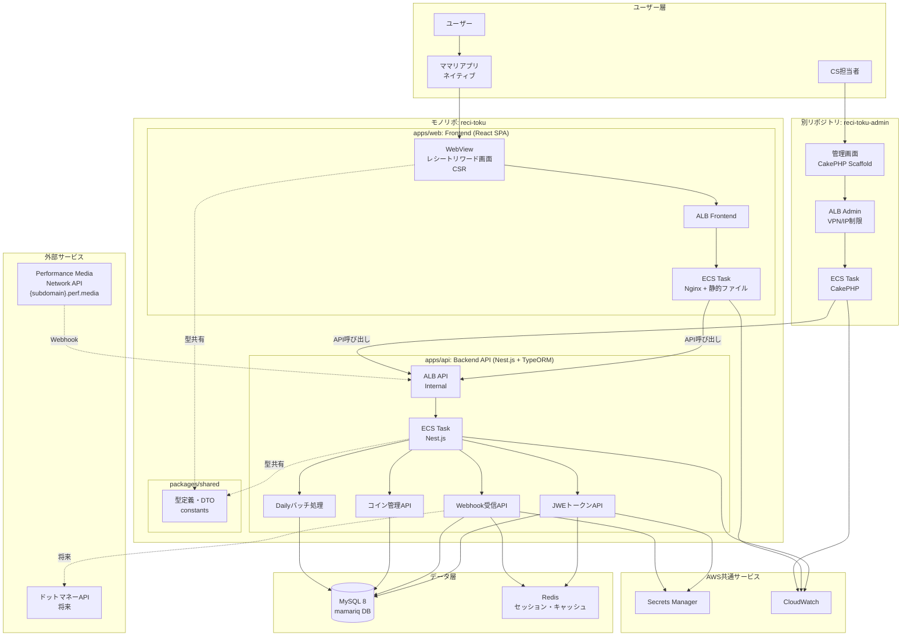

# レシートリワード - アーキテクチャ設計書

このドキュメントは、レシートリワードシステムの技術アーキテクチャ、システム構成、インフラ設計の詳細をまとめたものです。

**関連ドキュメント:**
- **[開発ガイド（CLAUDE.md）](./CLAUDE.md)** - コーディング規約・ベストプラクティス
- **[データベース設計（DATABASE.md）](./DATABASE.md)** - テーブル定義・ユースケース別更新パターン

## 目次

1. [システム全体構成](#システム全体構成)
2. [リポジトリ構成](#リポジトリ構成)
3. [レイヤー構造（Clean Architecture）](#レイヤー構造clean-architecture)
4. [型共有パターン](#型共有パターン)
5. [外部連携フロー](#外部連携フロー)
6. [セキュリティ設計](#セキュリティ設計)
7. [AWS インフラ構成](#awsインフラ構成)
8. [CI/CD パイプライン](#cicdパイプライン)
9. [データベース設計](#データベース設計)

## システム全体構成

### 概要

レシートリワードシステムは、**モノリポで管理される2つのマイクロサービス**と**別リポジトリの管理画面**で構成されます：

1. **Backend API（Nest.js + TypeORM）**: ビジネスロジック、外部API連携、データ永続化
2. **Frontend（React SPA）**: ユーザー向けWebView画面、クライアントサイドレンダリング
3. **Admin（既存CakePHP）**: CS管理画面、Scaffold的な簡易UI（別リポジトリ）

### 外部連携

- **ママリアプリ**: 既存ネイティブアプリからWebView起動
- **Performance Media Network API**: `{subdomain}.perf.media`経由でレシートキャンペーン連携
- **ドットマネーAPI**: 将来実装予定

### モノリポ構成の方針

| 観点 | 方針 | 理由 |
| --- | --- | --- |
| **コード管理** | モノリポ（Turborepo + pnpm） | 型共有、原子的な変更、開発体験向上 |
| **デプロイ** | 独立（ECS Task別々） | スケーリング独立性、障害隔離 |
| **型定義** | `packages/shared` で一元管理 | API契約の整合性保証 |
| **ビルド** | Turborepo でキャッシュ最適化 | 変更があったアプリのみビルド |
| **テスト** | E2Eはモノリポで統合実行 | 両サービス同時起動が容易 |

### 高レベルアーキテクチャ図



**図の説明**:

- **ユーザー層**: エンドユーザー、CS担当者、ママリアプリ
- **モノリポ**: apps/api（Backend）とapps/web（Frontend）をTurborepo + pnpmで管理
- **型共有**: packages/sharedで型定義を一元管理、Frontend/Backend両方から参照
- **別リポジトリ**: 管理画面は既存CakePHPを使用（独立デプロイ）
- **データ層**: MySQL 8（既存mamariq DB）、Redis（キャッシュ・セッション）
- **外部連携**: Performance Media Network API（Webhook経由）、将来的にドットマネーAPI

## リポジトリ構成

### モノリポ構成（このリポジトリ）

```
reci-toku/                       # モノリポルート
├── apps/
│   ├── api/                         # Nest.js Backend
│   │   ├── src/
│   │   │   ├── domain/             # ドメイン層（フレームワーク非依存）
│   │   │   │   ├── coin/
│   │   │   │   │   ├── coin.entity.ts
│   │   │   │   │   ├── coin.repository.interface.ts
│   │   │   │   │   └── value-objects/
│   │   │   │   ├── receipt/
│   │   │   │   │   ├── receipt.entity.ts
│   │   │   │   │   └── receipt.repository.interface.ts
│   │   │   │   └── shared/
│   │   │   │       ├── value-objects/
│   │   │   │       └── exceptions/
│   │   │   ├── usecase/            # ユースケース層
│   │   │   │   ├── coin/
│   │   │   │   │   ├── get-coin-balance.usecase.ts
│   │   │   │   │   └── update-coin-balance.usecase.ts
│   │   │   │   ├── auth/
│   │   │   │   │   └── generate-jwe-token.usecase.ts
│   │   │   │   └── webhook/
│   │   │   │       └── process-webhook.usecase.ts
│   │   │   ├── infrastructure/     # インフラ層
│   │   │   │   ├── database/
│   │   │   │   │   ├── entities/  # TypeORM Entity
│   │   │   │   │   └── repositories/
│   │   │   │   ├── secrets/
│   │   │   │   │   └── secrets.service.ts
│   │   │   │   └── external-api/
│   │   │   │       └── pmn-api.client.ts
│   │   │   └── presenter/          # プレゼンター層
│   │   │       ├── http/
│   │   │       │   ├── coin/
│   │   │       │   │   └── coin.controller.ts
│   │   │       │   └── webhook/
│   │   │       │       └── webhook.controller.ts
│   │   │       └── common/
│   │   │           ├── guards/
│   │   │           └── decorators/
│   │   ├── test/
│   │   └── Dockerfile.dev
│   │
│   └── web/                         # React SPA Frontend
│       ├── src/
│       │   ├── pages/              # ページコンポーネント
│       │   │   ├── Home.tsx       # レシートリワードTOP
│       │   │   └── History.tsx    # コイン履歴
│       │   ├── components/
│       │   │   ├── ui/            # 共通UIコンポーネント
│       │   │   ├── coin/
│       │   │   └── receipt/
│       │   ├── lib/
│       │   │   ├── api-client.ts  # Backend API クライアント
│       │   │   └── utils.ts
│       │   ├── hooks/
│       │   │   └── useCoinBalance.ts
│       │   ├── App.tsx            # ルートコンポーネント
│       │   └── main.tsx           # エントリーポイント
│       ├── public/
│       ├── index.html
│       └── Dockerfile.dev
│
├── packages/
│   ├── config/                      # 共通設定
│   │   ├── eslint-config/
│   │   ├── tsconfig/
│   │   │   ├── base.json
│   │   │   ├── react.json
│   │   │   └── nestjs.json
│   │   └── prettier-config/
│   ├── shared/                      # 型共有パッケージ
│   │   ├── src/
│   │   │   ├── types/
│   │   │   │   ├── api.ts         # APIレスポンス型
│   │   │   │   ├── coin.ts
│   │   │   │   └── webhook.ts     # Webhookペイロード型
│   │   │   └── constants/
│   │   │       └── api.ts         # APIエンドポイント定数
│   │   └── package.json
│   └── domain/                      # ドメインロジック共有（オプション）
│       └── package.json
│
├── docker-compose.yml
├── turbo.json
├── pnpm-workspace.yaml
├── CLAUDE.md
└── README.md
```

### 別リポジトリ

```
receipt-reward-admin/                # 既存CakePHP管理画面
├── src/
├── config/
└── composer.json
```

## レイヤー構造（Clean Architecture）

Backend（apps/api）は4層のClean Architectureを採用します。

### 依存関係図

```
Presenter Layer (Controllers, DTOs)
         ↓
UseCase Layer (Application Logic)
         ↓
Domain Layer (Entities, ValueObjects, Repository Interfaces)
         ↑
Infrastructure Layer (Repository Implementations, External APIs)
```

### 各層の責務と依存関係

| 層 | ディレクトリ | 責務 | 依存 |
| --- | --- | --- | --- |
| **Presenter** | `src/presenter/` | HTTP通信、バリデーション、認証・認可、DTO変換 | UseCase |
| **UseCase** | `src/usecase/` | アプリケーションロジック、ビジネスフロー制御 | Domain, Infrastructure |
| **Domain** | `src/domain/` | Entity、ValueObject、Repository Interface
ビジネスルール | なし（完全に独立） |
| **Infrastructure** | `src/infrastructure/` | DB接続、外部API、キャッシュ、秘密鍵管理
Domain層のInterfaceを実装 | Domain |

### 依存関係のルール

1. **Presenter → UseCase → Domain** の単方向依存
2. **Infrastructure → Domain**（DomainのInterfaceを実装）
3. **Domain層は他の層に依存しない**（依存性逆転の原則DIP）
4. **Domain層はフレームワークにも依存しない**（Pure TypeScript）
5. **フレームワーク依存はPresenterとInfrastructureのみ**

### レイヤー実装例

#### Domain層（フレームワーク非依存）

```typescript
// src/domain/coin/coin.entity.ts
export class Coin {
  private constructor(
    public readonly userId: number,
    public readonly balance: number,
    public readonly lastUpdatedAt: Date,
  ) {
    if (balance < 0) {
      throw new Error('Balance cannot be negative');
    }
  }

  static create(userId: number, balance: number): Coin {
    return new Coin(userId, balance, new Date());
  }

  addBalance(amount: number): Coin {
    return new Coin(this.userId, this.balance + amount, new Date());
  }
}

// src/domain/coin/coin.repository.interface.ts
export interface ICoinRepository {
  findByUserId(userId: number): Promise<Coin | null>;
  save(coin: Coin): Promise<void>;
}
```

#### UseCase層

```typescript
// src/usecase/coin/update-coin-balance.usecase.ts
import { Injectable } from '@nestjs/common';
import { ICoinRepository } from '../../domain/coin/coin.repository.interface';

@Injectable()
export class UpdateCoinBalanceUseCase {
  constructor(
    private readonly coinRepository: ICoinRepository,
  ) {}

  async execute(userId: number, amount: number): Promise<void> {
    const coin = await this.coinRepository.findByUserId(userId);
    if (!coin) {
      throw new Error('Coin not found');
    }

    const updatedCoin = coin.addBalance(amount);
    await this.coinRepository.save(updatedCoin);
  }
}
```

#### Infrastructure層

```typescript
// src/infrastructure/database/repositories/coin.repository.ts
import { Injectable } from '@nestjs/common';
import { ICoinRepository } from '../../../domain/coin/coin.repository.interface';
import { Coin } from '../../../domain/coin/coin.entity';

@Injectable()
export class CoinRepository implements ICoinRepository {
  async findByUserId(userId: number): Promise<Coin | null> {
    // TypeORMでDB取得
    // Entityに変換して返す
  }

  async save(coin: Coin): Promise<void> {
    // DB保存処理
  }
}
```

#### Presenter層

```typescript
// src/presenter/http/coin/coin.controller.ts
import { Controller, Get, Param } from '@nestjs/common';
import { GetCoinBalanceUseCase } from '../../../usecase/coin/get-coin-balance.usecase';

@Controller('coin')
export class CoinController {
  constructor(
    private readonly getCoinBalanceUseCase: GetCoinBalanceUseCase,
  ) {}

  @Get('balance/:userId')
  async getBalance(@Param('userId') userId: number) {
    const balance = await this.getCoinBalanceUseCase.execute(userId);
    return { balance };
  }
}
```

## 型共有パターン

### packages/shared での型定義

```typescript
// packages/shared/src/types/coin.ts
export interface CoinBalanceResponse {
  balance: number;
}

export interface CoinTransaction {
  id: number;
  type: 'earn' | 'spend' | 'expire';
  amount: number;
  description: string;
  createdAt: string;
}
```

```typescript
// packages/shared/src/types/webhook.ts
/** Webhook ペイロード（Performance Media Network仕様） */
export interface WebhookPayload {
  media_id: string;
  media_user_code: string;
  receipt_campaign_id: string;
  receipt_campaign_name: string;
  receipt_campaign_image: string | null;
  company_name: string | null;
  company_id: string | null;
  service_type: 'receipt' | 'mission';
  participation_timestamp: string;  // ISO 8601
  processed_timestamp: string;      // ISO 8601
  incentive_points: number;
  media_cashback_id: string;        // UUID（べき等性キー）
  media_cashback_code: string;      // 15桁
}
```

```typescript
// packages/shared/src/constants/api.ts
export const API_ENDPOINTS = {
  COIN_BALANCE: '/api/coin/balance',
  COIN_HISTORY: '/api/coin/history',
  AUTH_TOKEN: '/api/auth/token',
  WEBHOOK: '/api/webhook',
} as const;

export const COIN_EXPIRY_MONTHS = 6;
```

### Backend での型使用

```typescript
// apps/api/src/presenter/http/coin/dto/coin-balance-response.dto.ts
import { CoinBalanceResponse } from '@repo/shared/types';
import { IsNumber } from 'class-validator';

export class CoinBalanceResponseDto implements CoinBalanceResponse {
  @IsNumber()
  balance: number;
}
```

### Frontend での型使用

```typescript
// apps/web/src/lib/api-client.ts
import type { CoinBalanceResponse, CoinTransaction } from '@repo/shared/types';
import { API_ENDPOINTS } from '@repo/shared/constants';

export async function getCoinBalance(userId: number): Promise<CoinBalanceResponse> {
  const res = await fetch(`${API_ENDPOINTS.COIN_BALANCE}/${userId}`);
  return res.json();
}
```

## 外部連携フロー

### Performance Media Network API連携シーケンス

```
【フェーズ1: 認証・画面遷移】
ユーザー → ママリアプリ: おトクタブをタップ
ママリアプリ → React SPA: WebView起動
React SPA → Nest.js: GET /api/auth/token {userId}
Nest.js → Secrets Manager: JWE暗号化鍵取得
Secrets Manager → Nest.js: 256bit AES-GCM Key + client_id
Nest.js: JWE生成 payload: {media_user_code: userId}
Nest.js → React SPA: {jweToken: "eyJhb..."}
React SPA → PMN API: リダイレクト GET /?jwe={token}
PMN API: JWE復号・検証
PMN API → ユーザー: キャンペーン一覧表示

【フェーズ2: レシート投稿】
ユーザー → PMN API: キャンペーン選択
ユーザー → PMN API: レシート撮影・送信
PMN API → ユーザー: 受付完了表示
PMN API: OCR解析実行（非同期）

【フェーズ3: コイン付与（Webhook）】
PMN API → Nest.js: POST /api/webhook {jwe: "eyJhb..."}
Nest.js → Secrets Manager: JWE復号鍵取得
Nest.js: JWE復号・検証 → WebhookPayload

トランザクション開始:
  Nest.js → MySQL: INSERT receipt_rewards（media_cashback_id Unique制約）

  分岐:
    重複エラー → Nest.js → PMN API: 200 OK（べき等性）

    正常:
      Nest.js → MySQL: UPDATE user_coins SET balance += points
      Nest.js → MySQL: INSERT coin_transactions
      コミット
      Nest.js → PMN API: 200 OK
      Nest.js → SQS/SNS: プッシュ通知メッセージ送信（非同期）
      SQS/SNS → 既存プッシュ通知システム: 処理
      既存プッシュ通知システム → ママリアプリ: Push通知送信
      ママリアプリ → ユーザー: 「コインが付与されました」
```

### WED/ONE APIエンドポイント仕様

**ベースURL**: `https://{subdomain}.perf.media`（サブドメインは事前割り当て）

#### GET / （ホーム画面）

- **説明**: キャンペーン一覧表示
- **認証**: オプション（未認証でも公開コンテンツ表示可能）
- **パラメータ**: `?jwe=xxx`（JWEトークン、オプション）
- **レスポンス**: HTML
- **Set-Cookie**: 認証成功時、セッションCookie（Max-Age=3600、1時間有効）

**例**:
```
https://mamari.perf.media/?jwe=eyJhbGciOiJkaXIiLCJlbmMiOiJBMjU2R0NNIiwia2lkIjoiY2xpZW50XzEyMzQ1In0...
```

#### GET /activity （ミッション参加履歴）

- **説明**: ユーザーのレシート投稿履歴
- **認証**: 必須
- **パラメータ**: `?jwe=xxx`（JWEトークン、必須）
- **ペイロード**: `{media_user_code: string}`（必須）
- **レスポンス**: HTML

**例**:
```
https://mamari.perf.media/activity?jwe=eyJhbGciOiJkaXIiLCJlbmMiOiJBMjU2R0NNIiwia2lkIjoiY2xpZW50XzEyMzQ1In0...
```

#### GET /mission/{mission_id} （ミッション詳細）

- **説明**: 特定キャンペーンの詳細
- **認証**: 必須
- **パラメータ**: `?jwe=xxx`（JWEトークン、必須）
- **パスパラメータ**: `mission_id`（UUID形式）
- **レスポンス**: HTML

**例**:
```
https://mamari.perf.media/mission/319fd1f1-04d6-4943-8469-4dacbbb15a3a?jwe=eyJhbGciOiJkaXIiLCJlbmMiOiJBMjU2R0NNIiwia2lkIjoiY2xpZW50XzEyMzQ1In0...
```

### JWE暗号化・復号化（Performance Media Network仕様）

**暗号化アルゴリズム**: A256GCM（AES-256-GCM）

**JWE仕様**:

| 項目 | 値 | 説明 |
| --- | --- | --- |
| アルゴリズム | `dir` | Direct Key Agreement（鍵を直接使用） |
| 暗号化方式 | `A256GCM` | AES-256-GCM |
| 初期化ベクタ（IV） | 96bit/12bytes | 毎回ランダム生成必須 |
| キーID（kid） | `client_id` | Secrets Managerから取得 |
| ペイロード | `{media_user_code: string}` | ユーザーID（必須） |
| セッション有効期限 | 1時間（Max-Age=3600） | WED側で発行されるCookie |

**セキュリティ要件**:

- ✅ JWEトークンは**1回限り有効**（使い回し禁止）
- ✅ 初期化ベクタ（IV）は**毎回ランダム生成**（同じIVの再利用は禁止）
- ✅ `encryption_key`と`client_id`は**Secrets Managerで管理**
- ✅ 通信は**HTTPS必須**

**実装例**:

```typescript
// apps/api/src/usecase/auth/generate-jwe-token.usecase.ts
import { Injectable } from '@nestjs/common';
import * as jose from 'jose';
import { SecretsService } from '../../infrastructure/secrets/secrets.service';

@Injectable()
export class GenerateJweTokenUseCase {
  constructor(private readonly secretsService: SecretsService) {}

  async execute(userId: number): Promise<string> {
    // Secrets Managerから認証情報取得
    const { encryptionKey, clientId } = await this.secretsService.getPMNCredentials();

    // Base64デコード
    const key = Buffer.from(encryptionKey, 'base64');

    // Payload生成
    const payload = {
      media_user_code: userId.toString(),
    };

    // JWE生成（kidにclient_idを含める）
    const jwe = await new jose.CompactEncrypt(
      new TextEncoder().encode(JSON.stringify(payload))
    )
      .setProtectedHeader({
        alg: 'dir',
        enc: 'A256GCM',
        kid: clientId,  // Performance Media Network仕様
      })
      .encrypt(key);

    return jwe;
  }
}
```

### Webhook受信処理（べき等性保証）

**WED/ONEのリトライポリシー**:

Performance Media Network（WED/ONE）は以下のリトライ戦略を採用しています：

- **リトライ条件**: 400/500エラー時に自動リトライ
- **最大リトライ回数**: 18回
- **リトライ期間**: 約3.8日間（3d 19h 14m 54s）
- **リトライ方式**: 指数バックオフ（Exponential Backoff）
- **リトライ失敗後**: ステータスが`aborted`になり、還元通知処理停止

**ママリ側の対応方針**:

- **べき等性保証**: 重複リトライでも安全に処理（`media_cashback_id` UNIQUE制約）
- **400エラー**: 恒久的エラー（キャンペーン未登録、不正なペイロード等）はリトライさせない
- **500エラー**: 一時的エラー（DB接続障害等）はリトライさせる

**べき等性の実装ポイント**:

1. **`media_cashback_id`にUNIQUE制約**
   - Performance Media Networkから送信される一意のID
   - 重複受信を防ぐための主キー

2. **`media_cashback_code`の記録**
   - 15桁の一意のコード（Performance Media Network仕様）
   - ユーザー向け表示用（レシート履歴等）

3. **重複時は200 OKを返す**
   - Performance Media Networkにリトライさせない
   - べき等性を保証

4. **トランザクション内で整合性保証**
   - `reci_toku_rewards`, `reci_toku_user_coins`, `reci_toku_coin_transactions`の3テーブル更新を原子的に実行

**実装例**:

```typescript
// apps/api/src/presenter/http/webhook/webhook.controller.ts
import { Controller, Post, Body } from '@nestjs/common';
import { WebhookPayload } from '@repo/shared/types';
import { ProcessWebhookUseCase } from '../../../usecase/webhook/process-webhook.usecase';

@Controller('webhook')
export class WebhookController {
  constructor(
    private readonly processWebhookUseCase: ProcessWebhookUseCase,
  ) {}

  @Post()
  async handleWebhook(@Body() payload: WebhookPayload) {
    try {
      await this.processWebhookUseCase.execute(payload);
      return { status: 'success' };
    } catch (error) {
      if (error.code === 'ER_DUP_ENTRY') {
        // 既に処理済み（べき等性）
        return { status: 'already_processed' };
      }
      throw error;
    }
  }
}
```

**データベーススキーマ例**:

```sql
CREATE TABLE receipt_rewards (
  id BIGINT UNSIGNED AUTO_INCREMENT PRIMARY KEY,
  user_id BIGINT UNSIGNED NOT NULL,
  media_cashback_id VARCHAR(255) NOT NULL UNIQUE,  -- べき等性確保
  media_cashback_code VARCHAR(15) NOT NULL,        -- 15桁コード
  campaign_name VARCHAR(255) NOT NULL,
  incentive_points INT NOT NULL,
  processed_at DATETIME NOT NULL,
  created_at DATETIME NOT NULL DEFAULT CURRENT_TIMESTAMP,
  INDEX idx_user_id (user_id),
  INDEX idx_media_cashback_id (media_cashback_id)
) ENGINE=InnoDB DEFAULT CHARSET=utf8mb4;
```

### プッシュ通知の設計方針

**通知テーブルは作成せず、既存システムに委譲**

レシートリワードシステムでは、プッシュ通知専用のテーブルを作成しません。

**方針:**
- Webhook受信でコイン付与が成功したら、SQS/SNS経由で既存のママリプッシュ通知システムにメッセージを送信
- 通知の履歴管理は既存システムに任せる
- `reci_toku_rewards` テーブルが通知トリガーの証跡として機能

**理由:**
- ✅ 既存のプッシュ通知インフラを活用（重複実装を避ける）
- ✅ レシートリワードシステムの責務をシンプルに保つ
- ✅ 疎結合なアーキテクチャ（通知システムの変更がレシートリワードに影響しない）
- ✅ 通知履歴は `reci_toku_rewards` の `created_at` で追跡可能

**実装イメージ:**
```typescript
// usecase/webhook/process-webhook.usecase.ts
async execute(payload: WebhookPayload): Promise<void> {
  // トランザクション内でDB更新
  await this.transactionManager.run(async () => {
    await this.rewardRepository.save(reward);
    await this.coinRepository.updateBalance(userId, amount);
    await this.transactionRepository.save(transaction);
  });

  // トランザクション成功後、非同期でプッシュ通知
  await this.notificationService.sendToQueue({
    userId,
    type: 'reci_toku_earned',
    data: {
      campaignName: payload.receipt_campaign_name,
      points: payload.incentive_points,
    },
  });
}
```

## セキュリティ設計

### AWS Secrets Manager による秘密鍵管理

**管理対象の秘密情報**:

| 名前 | 用途 | ローテーション |
| --- | --- | --- |
| `reci-toku/pmn-credentials` | JWE暗号化鍵（encryption_key、client_id） | 手動（90日推奨） |
| `reci-toku/db-credentials` | MySQL接続情報 | 自動（90日） |
| `reci-toku/dotmoney-credentials` | ドットマネーAPI認証情報（将来） | 手動 |

**アクセス制御**:
- ECSタスクロールにのみ読み取り権限付与
- CloudTrailでアクセスログを記録
- 変更時はSlack通知

### CORS設定

```typescript
// apps/api/src/main.ts
app.enableCors({
  origin: [
    'https://mamari.jp',
    'https://dev.mamari.jp',
    /\.mamari\.jp$/,  // サブドメイン許可
  ],
  credentials: true,
  methods: ['GET', 'POST', 'PUT', 'DELETE'],
  allowedHeaders: ['Content-Type', 'Authorization'],
});
```

### レート制限

**実装方式**: Redis + Token Bucket Algorithm

```typescript
// apps/api/src/presenter/common/guards/rate-limit.guard.ts
import { Injectable, CanActivate, ExecutionContext, HttpException } from '@nestjs/common';
import { Reflector } from '@nestjs/core';

@Injectable()
export class RateLimitGuard implements CanActivate {
  constructor(
    private redis: RedisService,
    private reflector: Reflector,
  ) {}

  async canActivate(context: ExecutionContext): Promise<boolean> {
    const request = context.switchToHttp().getRequest();
    const userId = request.user?.id || request.ip;
    const limit = this.reflector.get<number>('rateLimit', context.getHandler());

    const key = `rate-limit:${userId}:${request.route.path}`;
    const current = await this.redis.incr(key);

    if (current === 1) {
      await this.redis.expire(key, 60); // 1分
    }

    if (current > limit) {
      throw new HttpException('Too Many Requests', 429);
    }

    return true;
  }
}
```

## AWS インフラ構成

### ネットワーク構成

- **VPC**: ap-northeast-1
- **Public Subnet A/C**: ALB、NAT Gateway
- **Private Subnet A/C**: ECS Tasks
- **Data Subnet A/C**: RDS MySQL 8（Primary/Standby）
- **ElastiCache Subnet**: Redis

**固定IP要件（WED/ONE API連携用）**:

- **Dev環境**: 固定Elastic IP（AWS環境構築後に確定、WED社へ提供）
- **Prd環境**: 固定Elastic IP（AWS環境構築後に確定、WED社へ提供）
- **理由**: WED/ONEのWebhook送信時、ママリ側のIPアドレスをホワイトリスト登録する必要があるため
- **注意**: 既存q-apiとは別サービスのため、独立した固定IPが必要

### ECS タスク定義

**Backend Task**:
- Image: `reci-toku-api:latest`
- Port: 3000
- Environment: NODE_ENV=production
- Secrets: DB_PASSWORD（Secrets Manager）

**Frontend Task**:
- Image: `reci-toku-web:latest`（Nginx + 静的ファイル）
- Port: 80
- Environment: VITE_API_URL=https://api.internal.mamari.jp

### デプロイ戦略

- **Blue/Green Deployment**: CodeDeployによる段階的切り替え
- **ヘルスチェック**: ALBで `/health` エンドポイントを監視
- **ロールバック**: 自動（ヘルスチェック失敗時）

## CI/CD パイプライン

### Turborepo 設定

```json
{
  "$schema": "https://turbo.build/schema.json",
  "pipeline": {
    "build": {
      "dependsOn": ["^build"],
      "outputs": ["dist/**", "build/**"]
    },
    "test": {
      "dependsOn": ["^build"],
      "outputs": []
    },
    "lint": {
      "outputs": []
    },
    "deploy": {
      "dependsOn": ["build", "test"],
      "cache": false
    }
  }
}
```

### GitHub Actions ワークフロー

```yaml
name: CI/CD

on:
  push:
    branches: [main, develop]

jobs:
  changes:
    runs-on: ubuntu-latest
    outputs:
      api: ${{ steps.filter.outputs.api }}
      web: ${{ steps.filter.outputs.web }}
    steps:
      - uses: actions/checkout@v3
      - uses: dorny/paths-filter@v2
        id: filter
        with:
          filters: |
            api:
              - 'apps/api/**'
              - 'packages/shared/**'
            web:
              - 'apps/web/**'
              - 'packages/shared/**'

  build-api:
    needs: changes
    if: needs.changes.outputs.api == 'true'
    runs-on: ubuntu-latest
    steps:
      - uses: actions/checkout@v3
      - uses: pnpm/action-setup@v2
      - run: pnpm install
      - run: pnpm turbo run build --filter=api
      - run: pnpm turbo run test --filter=api
      # Docker build & push to ECR
      # ECS deploy

  build-web:
    needs: changes
    if: needs.changes.outputs.web == 'true'
    runs-on: ubuntu-latest
    steps:
      - uses: actions/checkout@v3
      - uses: pnpm/action-setup@v2
      - run: pnpm install
      - run: pnpm turbo run build --filter=web
      - run: pnpm turbo run test --filter=web
      # Docker build & push to ECR
      # ECS deploy
```

---

## データベース設計

レシートリワードシステムのデータベース設計の詳細は、**[DATABASE.md](./DATABASE.md)** を参照してください。

### 主要テーブル

1. **reci_toku_rewards**: 報酬履歴（Performance Media Network Webhook証跡）
2. **reci_toku_coin_transactions**: コイン取引台帳（増減履歴）
3. **reci_toku_user_coins**: ユーザーコイン残高
4. **reci_toku_campaigns**: キャンペーンマスタ
5. **reci_toku_coin_settings**: システム設定

### 重要な設計方針

**命名規則:**
- 全テーブルに `receipt_reward_` プレフィックスを付与（将来のDB分離を考慮）

**べき等性保証:**
- `reci_toku_rewards.media_cashback_id` に UNIQUE 制約
- Performance Media Networkからの重複Webhook受信を物理的にブロック

**外部キー制約:**
- 既存 `users` テーブルへのFK制約は貼らない（将来のDB分離を考慮）
- アプリケーション層で整合性を保証

**タイムゾーン:**
- 全DatetimeカラムはUTC保存
- Performance Media NetworkからのJSTタイムスタンプをUTCに変換

**アトミック更新:**
```sql
-- コイン残高の更新は必ずアトミックに行う
UPDATE reci_toku_user_coins
SET current_balance = current_balance + :amount,
    last_earned_at = NOW()
WHERE user_id = :user_id;
```

詳細は [DATABASE.md](./DATABASE.md) を参照してください。

---

## 参考リンク

- **[プロジェクト管理（GitHub Projects）](https://github.com/orgs/Connehito/projects/50)** - タスク管理・進捗確認
- [設計書](https://github.com/Connehito/mamari-spec/issues/6512)
- **[データベース設計（DATABASE.md）](./DATABASE.md)** - テーブル定義の詳細
- [開発ガイド（CLAUDE.md）](./CLAUDE.md)
- [Turborepo公式ドキュメント](https://turbo.build/)
- [Nest.js公式ドキュメント](https://docs.nestjs.com/)
- [TypeORM公式ドキュメント](https://typeorm.io/)
- [React公式ドキュメント](https://react.dev/)
- [Clean Architecture](https://blog.cleancoder.com/uncle-bob/2012/08/13/the-clean-architecture.html)
- [ADR：なぜNest.js(TS + Clean Architecture) + React(+TS)を選んだか](https://github.com/Connehito/mamari-spec/issues/6461)

---

**最終更新日**: 2026-02-19（Frontend: Next.js → React SPA、Backend: TypeORM明記）
